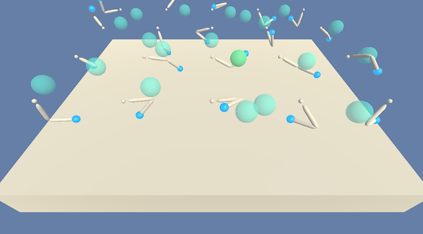

## Introduction
This project is being done as part of the [Udacity Deep Reinforcement Learning Nanodegree](https://www.udacity.com/course/deep-reinforcement-learning-nanodegree--nd893), a four month course that I am enrolled in.

We will use reinforcement learning to train an agent inside a [Unity-ML](https://github.com/Unity-Technologies/ml-agents) environment.  We will be working in an environment similar to [Reacher](https://github.com/Unity-Technologies/ml-agents/blob/master/docs/Learning-Environment-Examples.md#reacher).


## Environment Description
In this environment, we are training a double-jointed arm to move to a target location.  To speed up training we will be training 20 robotic arms simultaneously.  Each robotic arm is circled by a target sphere and the goal of the agent is to maintain its position at the target location for as many time steps as possible.


#### Observation Space
The observation space consists of 33 variables corresponding to position, rotation, velocity, and angular velocities of the arm.


#### Action Space
The action space is continuous and each action is a vector with four numbers, corresponding to torque applicable to two joints.  Every entry in the action vector is a number between -1 and 1.


#### Reward Structure
A reward from +0.01 to +0.04 is provided for each step that the agent's hand is in the goal location.  A higher reward is provided if the agent's hand is closer to the center of the target.

#### Solve Criteria
The agents must get an average score of +30 (over 100 consecutive episodes, and over all agents).  The environment is considered solved, when the average (over 100 episodes) of those average scores is at least +30.


Here's an example of a single observation of the environment:



## Installation

#### Pre-requisites
- Make sure you having a working version of [Anaconda](https://www.anaconda.com/download/) on your system.


#### Step 1: Clone the repo
Clone this repo using `git clone https://github.com/danielnbarbosa/drlnd_continuous_control.git`.


#### Step 2: Install Dependencies
Create an anaconda environment that contains all the required dependencies to run the project.

Mac:
```
conda create --name continuous_control python=3.6
source activate continuous_control
conda install -y python.app
conda install -y pytorch -c pytorch
pip install torchsummary unityagents
```

Windows:
```
conda create --name continuous_control python=3.6
activate continuous_control
conda install -y pytorch -c pytorch
pip install torchsummary unityagents
```

#### Step 3: Download Reacher environment
Install the pre-compiled Unity environment.  Select the appropriate file for your operating system:

- Linux: click [here](https://s3-us-west-1.amazonaws.com/udacity-drlnd/P2/Reacher/Reacher_Linux.zip)
- Mac OSX: click [here](https://s3-us-west-1.amazonaws.com/udacity-drlnd/P2/Reacher/Reacher.app.zip)
- Windows (32-bit): click [here](https://s3-us-west-1.amazonaws.com/udacity-drlnd/P2/Reacher/Reacher_Windows_x86.zip)
- Windows (64-bit): click [here](https://s3-us-west-1.amazonaws.com/udacity-drlnd/P2/Reacher/Reacher_Windows_x86_64.zip)

Download the file into the top level directory of this repo and unzip it.


## Train your agent
To train the agent run `learn.py`.  This will fire up the Unity environment and output live training statistics to the command line.  When training is finished you'll have a saved model in the `checkpoints` directory and see some graphs that help visualize the agent's learning progress.  If you haven't modified any of the hyperparameters it should take the agent 132 episodes to solve the environment.

To load a saved model run `learn.py --load=<path to files>`.  This will load the saved weights from a checkpoint file.  A previously trained model is included in this repo.  To load this model run `./learn.py --load=checkpoints/saved/reacher`.  Note that the underlying files are named 'reacher.actor.pth' and 'reacher.actor.pth' but you need only pass the common part of the file name, e.g. 'reacher'.

Note, Windows users will need to execute `python learn.py` instead of just `learn.py`.  This is due to matplotlib requiring a framework build of python on MacOS which is installed as pythonw and is hardcoded in the script.  More details [here](https://matplotlib.org/faq/osx_framework.html).

Feel to experiment with modifying the hyperparameters to see how it affects training.

## Report
See the [report](Report.md) for more details on the implementation.
