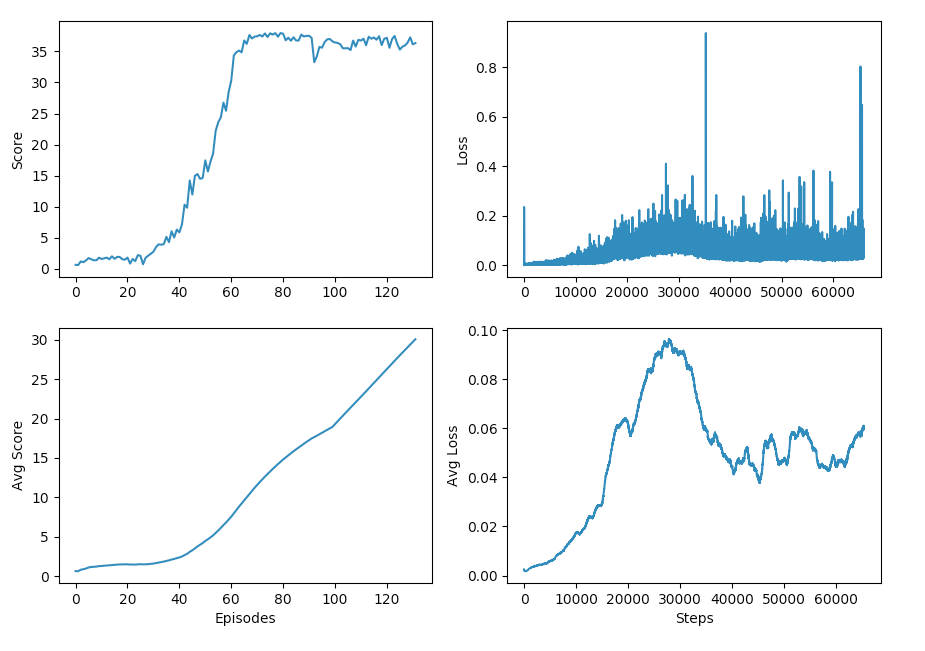

## Trained Agent
Here's what the agent looks like after training:

## Learning Algorithm
The algorithm chosen to solve this environment is Deep Deterministic Policy Gradient (DDPG).  DDPG can be seen as an extension of DQN, with three important enhancements:
 1. It works with continuous action spaces, key for solving robotic control problems.
 2. It uses an actor-critic model, using value based methods to reduce the variance of policy based methods.
 3. It is easily parallelized, further reducing variance and speeding up training.

The chosen hyperparameters closely follow those from the original [DDPG paper](https://arxiv.org/abs/1509.02971).  This includes:
  - Two layer networks for both actor and critic models.  The first hidden layer with 400 units and the second with 300.
  - Relu activation for all non linear activation functions.
  - Actions added in second layer of the critic.
  - Adam optimizer with learning rates of 1e-4 for the actor and 1e-3 for the critic.
  - Soft target update parameter tau of 1e-3.
  - Discount factor gamma of 0.99.

A few changes were made all of which were found to speed up training:
  - L2 weight_decay of the critic set to 0.0001 vs 0.01 in the paper.
  - Batch size of 128 vs 64.
  - Update gradients every 2 steps vs every step.

## Plot of Rewards
Using the supplied hyperparameters the agent is able to solve the environments in 32 episodes:

[Detailed training results](assets/training_output.txt) if you are curious.

## Ideas for Future Work
Other enhancements that I did not have time to explore but may yield promising results:
  - Add noise to the policy parameters.  There is [evidence](https://blog.openai.com/better-exploration-with-parameter-noise/) that this can boost performance.
  - Use the PPO algorithm.  A policy gradient method that is also very effective, though it would have to be adapted for continuous action spaces.
